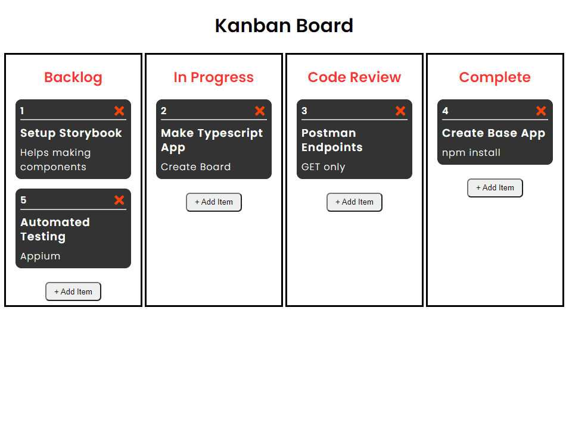

# kanban

A Kanban board with drag and drop functionality.
Created using React, TypeScript and react-dnd.
Testing done using Jest and Cypress

# Running this app
Site is currently live at https://luketellis.github.io/kanban/

Locally try the following:
- clone this repository
- install the modules
- start the application 'npm start

```
$ npm install
$ npm start
```

# Testing this app

Cypress tests can be run with:
```
$ npm run cypress
```

Jest tests can be run with:
```
$ npm run test
```

## Example Run


